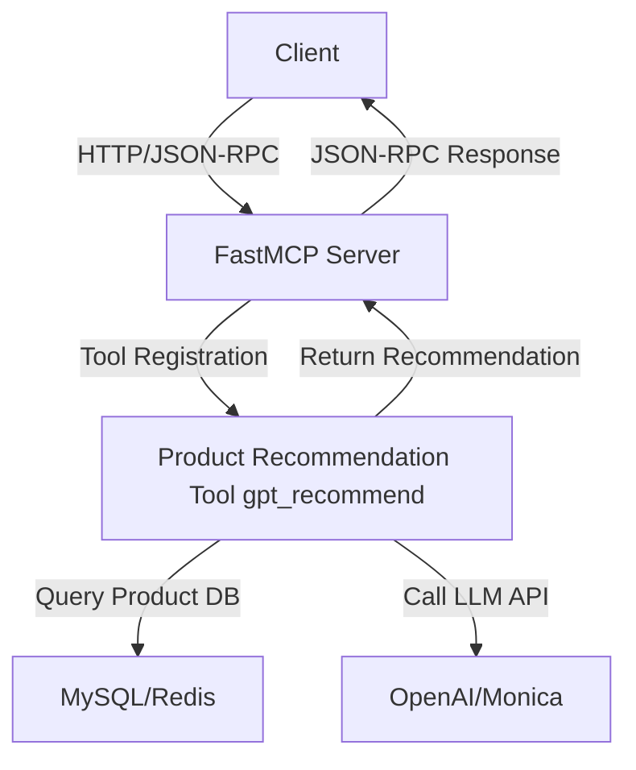

[English](README.md) | [简体中文](README.zh.md)

# MCP Product Suggester — Universal Product Recommendation MCP Server

A minimal, universal **MCP Server** for product recommendation, based on [fastmcp](https://github.com/jlowin/fastmcp).
**Out-of-the-box, open source, supports any table structure, and fully compatible with the MCP (Model Context Protocol) ecosystem.**

---

> **This project is a modern, async MCP Server that registers product recommendation tools via the fastmcp protocol.**
>
> - **Standard MCP tool registration:** All recommendation logic is exposed as MCP tools, easily callable by any MCP-compatible client.
> - **LLM-powered:** Integrates OpenAI, Monica, etc. for intelligent recommendations.
> - **Universal protocol:** Fully compatible with MCP/fastmcp clients, supports JSON-RPC, HTTP, SSE, and more.
> - **Ideal for:** E-commerce, content platforms, AI bots, SaaS, and any scenario needing standardized model tool serving.

---

## Project Overview

This project is a modern, minimal, async product recommendation service built on [fastmcp](https://github.com/jlowin/fastmcp), integrating LLMs (such as OpenAI, Monica) for intelligent product recommendations.
**Ideal for e-commerce, content platforms, AI bots, SaaS, and more. Supports high concurrency and flexible extension.**

---

## What is MCP/fastmcp?

**MCP (Model Context Protocol)** is a universal protocol for the AI era, standardizing model service invocation, tool registration, and context management.
[fastmcp](https://github.com/jlowin/fastmcp) is the most popular Python implementation, supporting minimal tool registration, async high concurrency, auto client, and rich context features.

- Official site: [gofastmcp.com](https://gofastmcp.com)
- GitHub: [jlowin/fastmcp](https://github.com/jlowin/fastmcp)

---

## MCP Principle & Flowchart

### Principle

1. **Server:** Register various "tools" (e.g., product recommendation, health check) with `FastMCP`. Each tool is a Python function/coroutine.
2. **Client:** Use `fastmcp.Client` to connect to the server and call tools remotely. Parameters and results are auto-serialized.
3. **Protocol:** Underlying protocol is JSON-RPC + HTTP/SSE/STDIO, supporting high concurrency, streaming, and context injection.
4. **LLM Integration:** Server can flexibly integrate OpenAI, Monica, etc., supporting multiple keys, proxy, rate limiting, retries, etc.

### Flowchart



---

## Features

- **Minimal async/await architecture** for high concurrency
- **One-line fastmcp tool registration** for API exposure
- **Supports any table/field structure** (no adapters needed)
- **Switchable LLM backend** (Monica/OpenAI)
- **Fully async**; recommended deployment with uv/uvicorn
- **Automatic dependency management**, out-of-the-box
- **Detailed documentation and beginner-friendly config**
- **Comprehensive unit tests, easy for secondary development**

---

## Directory Structure

```
mcp-product-suggester/
├── server.py         # FastMCP registration & startup
├── gpt_service.py    # GPT recommendation service, multi-LLM support
├── database.py       # Async DB operations
├── common/           # Config, logging, etc.
├── client.py         # Minimal client example
├── requirements.txt  # Dependencies
├── README.md         # Documentation
├── .env              # Environment variables (create yourself)
└── tests/            # Unit tests
```

---

## Environment Variables & Configuration (Beginner Friendly)

All configuration is managed via a `.env` file in the project root.
**Strongly recommended:** create a `.env` file and put all sensitive info and parameters here.

### 1. Database Configuration

For connecting to your product database (MySQL).
**Example:**

```env
DB_HOST=localhost         # DB server address, usually localhost
DB_PORT=3306              # DB port, MySQL default 3306
DB_USER=root              # DB username
DB_PASS=password          # DB password
DB_BASE=product_db        # DB name
```

> ⚠️ Make sure your database is created and product data imported.

### 2. Redis Configuration (Optional)

For caching (optional).
**Example:**

```env
REDIS_HOST=localhost
REDIS_PORT=6379
REDIS_DB=0
REDIS_PASSWORD=
```

> Not required for development; recommended for production.

### 3. GPT/LLM Service Configuration

For intelligent recommendations. Supports Monica or OpenAI (choose one).

**Monica:**

```env
LLM_PROVIDER=monica
MONICA_API_KEY=your_monica_api_key
```

**OpenAI:**

```env
LLM_PROVIDER=openai
OPENAI_API_KEY=your_openai_api_key
```

> Only configure one; leave the other blank.

### 4. Network Proxy (for LLM API access)

If your server cannot access OpenAI/Monica directly, set up an HTTP proxy.
**Example:**

```env
PROXY_URL=http://127.0.0.1:7890
```

- Supports http/https proxies, e.g., `http://ip:port`
- If using Clash, V2RayN, etc., the port is usually 7890 or 1080
- Leave blank or remove if not needed

> ⚠️ Proxy only affects GPT API requests, not DB or other services.

### 5. Product Table & SQL Template

Supports any table structure—just configure table name and SQL template.

**Example:**

```env
PRODUCT_TABLE=your_table_name
PRODUCT_SQL_TEMPLATE=SELECT * FROM {table} WHERE deleted_at IS NULL AND available = 1 ORDER BY created_at DESC LIMIT {limit}
```

- `{table}` is replaced with your table name
- `{limit}` is replaced with the query limit

### 6. Common Issues & Troubleshooting

- **.env not working?**
  Make sure the file is named `.env` and in the project root. Restart the service.
- **DB connection failed?**
  Check host, port, username, password, DB name, and DB service status.
- **No GPT response?**
  Check API key, proxy settings, and proxy port.
- **Proxy not working?**
  Ensure proxy software is running, port is correct, and test with a browser.

### 7. Complete .env Example

```env
# Database
DB_HOST=localhost
DB_PORT=3306
DB_USER=root
DB_PASS=password
DB_BASE=product_db

# Redis (optional)
REDIS_HOST=localhost
REDIS_PORT=6379
REDIS_DB=0
REDIS_PASSWORD=

# GPT/LLM (choose one)
LLM_PROVIDER=monica
MONICA_API_KEY=your_monica_api_key
# LLM_PROVIDER=openai
# OPENAI_API_KEY=your_openai_api_key

# Proxy (if needed)
PROXY_URL=http://127.0.0.1:7890

# Product table & SQL
PRODUCT_TABLE=your_table_name
PRODUCT_SQL_TEMPLATE=SELECT * FROM {table} WHERE deleted_at IS NULL AND available = 1 ORDER BY created_at DESC LIMIT {limit}
```

### 8. Server Port & Client URL

To customize the server port and client connection address, add the following to your `.env` file:

```env
SERVER_PORT=8000         # The port your MCP server listens on (default: 8000)
SERVER_URL=http://localhost:8000  # The URL your client uses to connect to the MCP server (default: http://localhost:8000)
```

- `SERVER_PORT` is used by the server (`server.py`) to determine which port to listen on.
- `SERVER_URL` is used by the client (`client.py`, tests) to determine which server to connect to.

---

## Quick Start

### 1. Install uv (Recommended)

[uv](https://github.com/astral-sh/uv) is a super-fast Python package/dependency manager and virtual environment tool. It is recommended for this project.

```bash
# Install uv (if not already installed)
pip install uv

# Create a virtual environment (recommended)
uv venv

# Activate the virtual environment
# On Windows:
.\.venv\Scripts\activate
# On macOS/Linux:
source .venv/bin/activate

# Install dependencies
uv pip install -r requirements.txt
```

### 2. Start the MCP Server

```bash
uv run --with app server.py
```

### 3. Run the client test

```bash
uv run client.py
```

### 4. Run tests

```bash
uv pip install pytest  # if not installed
pytest tests/
```

---

## Development & Debugging

- Recommended: use VSCode/PyCharm, run `server.py` directly.
- Hot reload:
  ```bash
  uvicorn server:app --reload --host 0.0.0.0 --port 8000
  ```
- Test with Postman/curl (`/mcp` endpoint) or the provided `client.py`.

---

## Client Example

You can also run the client test directly:

```bash
uv run client.py  # Run the client test
```

---

## Module Overview

- `server.py`: Service entry, tool registration, web deployment
- `gpt_service.py`: GPT recommendation service, multi-LLM support
- `database.py`: Async DB operations
- `client.py`: Minimal client usage
- `common/`: Config, logging, etc.
- `tests/`: Unit tests

---

## References & Thanks

- [fastmcp official docs & repo](https://github.com/jlowin/fastmcp)
- [gofastmcp.com](https://gofastmcp.com)
- [OpenAI](https://openai.com/)
- [Monica LLM](https://monica.im/)

---

## Contributing

Pull requests and issues are welcome!
For suggestions, questions, or ideas, please use GitHub Discussions.

---

## License

MIT

---

For further questions or special requirements, feel free to open an issue!

---

**References:**

- [fastmcp GitHub](https://github.com/jlowin/fastmcp)
- [fastmcp Official Docs](https://gofastmcp.com/)
