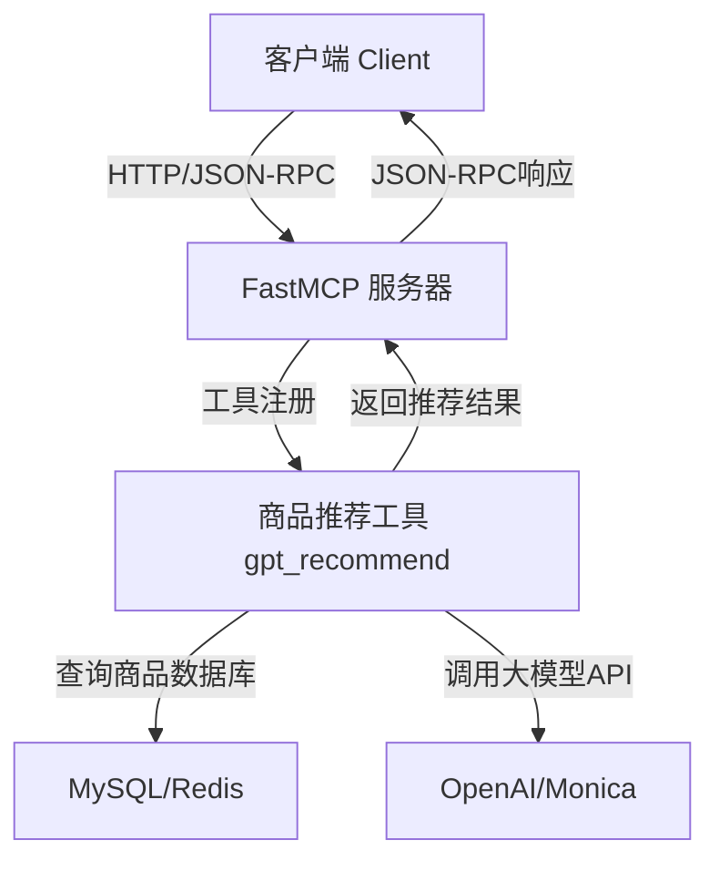

[English](README.md) | [简体中文](README.zh.md)

# MCP Product Suggester

基于 [fastmcp](https://github.com/jlowin/fastmcp) 的极简通用商品推荐服务  
**支持任意表结构，开箱即用，极致开源友好。**

---

## 项目简介

本项目是一个现代化、极简、异步的商品推荐服务，采用 [fastmcp](https://github.com/jlowin/fastmcp) 作为核心框架，结合大模型（如 OpenAI、Monica）实现智能商品推荐。  
**适合电商、内容平台、AI Bot、SaaS 等多种场景，支持高并发、灵活扩展。**

---

## 什么是 MCP/fastmcp？

**MCP（Model Context Protocol）** 是一种面向 AI 时代的通用"模型上下文协议"，用于标准化模型服务的调用、工具注册、上下文管理等。  
[fastmcp](https://github.com/jlowin/fastmcp) 是最流行的 Python MCP 实现，支持极简注册工具、异步高并发、自动客户端、丰富的上下文能力。

- 官网：[gofastmcp.com](https://gofastmcp.com)
- GitHub：[jlowin/fastmcp](https://github.com/jlowin/fastmcp)

---

## MCP 原理与流程图

### 原理说明

1. **Server 端**：用 `FastMCP` 注册各种"工具"（如商品推荐、健康检查等），每个工具就是一个 Python 函数/协程。
2. **Client 端**：用 `fastmcp.Client` 连接服务器，远程调用工具，参数和结果自动序列化。
3. **协议**：底层采用 JSON-RPC + HTTP/SSE/STDIO 等多种传输协议，支持高并发、流式、上下文注入等高级特性。
4. **大模型集成**：服务端可灵活集成 OpenAI、Monica 等 LLM，支持多 Key、代理、限流、重试等。

### 流程图



---

## 主要特性

- **极简 async/await 架构**，支持高并发
- **fastmcp 工具注册**，一行代码暴露 API
- **支持任意表结构和字段**，无需适配器
- **大模型后端可切换**（Monica/OpenAI）
- **全链路异步**，推荐用 uv/uvicorn 部署
- **自动依赖管理**，开箱即用
- **详细文档与小白友好配置说明**
- **完善单元测试，易于二次开发**

---

## 目录结构

```
mcp-product-suggester/
├── server.py         # FastMCP 服务注册与启动
├── gpt_service.py    # GPT推荐服务，支持多大模型
├── database.py       # 异步数据库操作
├── common/           # 配置、日志等
├── client.py         # 极简客户端调用示例
├── requirements.txt  # 依赖清单
├── README.md         # 项目说明文档
├── .env              # 环境变量配置（需自行创建）
└── tests/            # 单元测试
```

---

## 环境变量与配置（详细说明）

本项目支持通过 `.env` 文件集中管理所有配置。**强烈建议**在项目根目录新建 `.env` 文件，所有敏感信息和参数都写在这里，方便管理和修改。

### 1. 数据库配置

用于连接你的商品数据库（MySQL）。  
**示例：**

```env
DB_HOST=localhost         # 数据库服务器地址，通常本地用 localhost
DB_PORT=3306              # 数据库端口，MySQL 默认 3306
DB_USER=root              # 数据库用户名
DB_PASS=password          # 数据库密码
DB_BASE=product_db        # 数据库名
```

> ⚠️ 数据库必须提前建好，并导入商品表数据。

### 2. Redis 配置（可选）

如需缓存功能，可配置 Redis。  
**示例：**

```env
REDIS_HOST=localhost      # Redis 服务器地址
REDIS_PORT=6379           # Redis 端口
REDIS_DB=0                # Redis 数据库编号
REDIS_PASSWORD=           # Redis 密码（如无可留空）
```

> 一般开发测试可不填，生产环境建议开启缓存。

### 3. GPT/大模型服务配置

用于调用智能推荐的 GPT 服务。支持 Monica/OpenAI 两种后端，任选其一。

**Monica 配置：**

```env
LLM_PROVIDER=monica                   # 选择 monica
MONICA_API_KEY=your_monica_api_key    # Monica 平台申请的 API Key
```

**OpenAI 配置：**

```env
LLM_PROVIDER=openai                   # 选择 openai
OPENAI_API_KEY=your_openai_api_key    # OpenAI 平台申请的 API Key
```

> 只需配置一种，未用的可留空。

### 4. 网络代理（如需科学上网）

如果你的服务器无法直接访问 OpenAI/Monica，可以配置 HTTP 代理。  
**示例：**

```env
PROXY_URL=http://127.0.0.1:7890       # 代理服务器地址和端口
```

- 支持 http/https 代理，格式如 `http://ip:port`
- 如用 Clash、V2RayN 等本地代理工具，端口一般为 7890 或 1080
- 不需要代理时可留空或删除此行

> ⚠️ 代理配置仅影响 GPT 接口请求，不影响数据库等其他服务。

### 5. 商品表名和 SQL 模板

支持任意表结构，无需改代码，只需配置表名和 SQL 查询模板即可。

**示例：**

```env
PRODUCT_TABLE=your_table_name
PRODUCT_SQL_TEMPLATE=SELECT * FROM {table} WHERE deleted_at IS NULL AND available = 1 ORDER BY created_at DESC LIMIT {limit}
```

- `{table}` 会自动替换为你配置的表名
- `{limit}` 会自动替换为查询数量

### 6. 常见问题与排查

- **.env 文件没生效？**  
  确认文件名为 `.env`，且在项目根目录。重启服务后生效。
- **数据库连不上？**  
  检查主机、端口、用户名、密码、数据库名是否正确，数据库服务是否已启动。
- **GPT 推荐无响应？**  
  检查 API Key 是否正确，是否需要代理，代理端口是否开放。
- **代理无效？**  
  检查代理软件是否运行，端口是否正确，尝试用浏览器设置同样代理测试能否访问外网。

### 7. 完整 .env 示例

```env
# 数据库配置
DB_HOST=localhost
DB_PORT=3306
DB_USER=root
DB_PASS=password
DB_BASE=product_db

# Redis配置（可选）
REDIS_HOST=localhost
REDIS_PORT=6379
REDIS_DB=0
REDIS_PASSWORD=

# GPT/大模型服务配置（任选其一）
LLM_PROVIDER=monica
MONICA_API_KEY=your_monica_api_key_here
# LLM_PROVIDER=openai
# OPENAI_API_KEY=your_openai_api_key_here

# 网络代理（如需）
PROXY_URL=http://127.0.0.1:7890

# 商品表名和SQL模板
PRODUCT_TABLE=your_table_name
PRODUCT_SQL_TEMPLATE=SELECT * FROM {table} WHERE deleted_at IS NULL AND available = 1 ORDER BY created_at DESC LIMIT {limit}
```

---

## 快速开始

```bash
uv venv
uv pip install -r requirements.txt

# 启动服务（推荐）
uv run --with app server.py

# 运行客户端测试（推荐）
uv run client.py

# 运行测试
uv pip install pytest  # 如未安装
pytest tests/
```

---

## 开发与调试

- 推荐用 VSCode/PyCharm 等 IDE，直接运行 `server.py`。
- 支持热重载开发：
  ```bash
  uvicorn server:app --reload --host 0.0.0.0 --port 8000
  ```
- 可用 Postman/curl 调用 `/mcp` 接口，或用 `client.py` 示例。

---

## 客户端调用示例

你也可以直接运行客户端测试：

```bash
uv run client.py
```

---

## 主要模块说明

- `server.py`：服务入口，注册工具，web 部署
- `gpt_service.py`：GPT 智能推荐服务，支持多大模型
- `database.py`：异步数据库操作
- `client.py`：极简客户端调用
- `common/`：配置、日志等
- `tests/`：单元测试

---

## 参考与致谢

- [fastmcp 官方文档与仓库](https://github.com/jlowin/fastmcp)
- [gofastmcp.com](https://gofastmcp.com)
- [OpenAI](https://openai.com/)
- [Monica LLM](https://monica.im/)

---

## 贡献

欢迎提交 Issue 和 PR！  
如有建议、问题或想法，欢迎在 GitHub 讨论区留言。

---

## 许可证

MIT

---

如需进一步补充其他部分或有特殊需求，欢迎随时提出！

---

**参考资料：**

- [fastmcp GitHub](https://github.com/jlowin/fastmcp)
- [fastmcp 官方文档](https://gofastmcp.com/)
